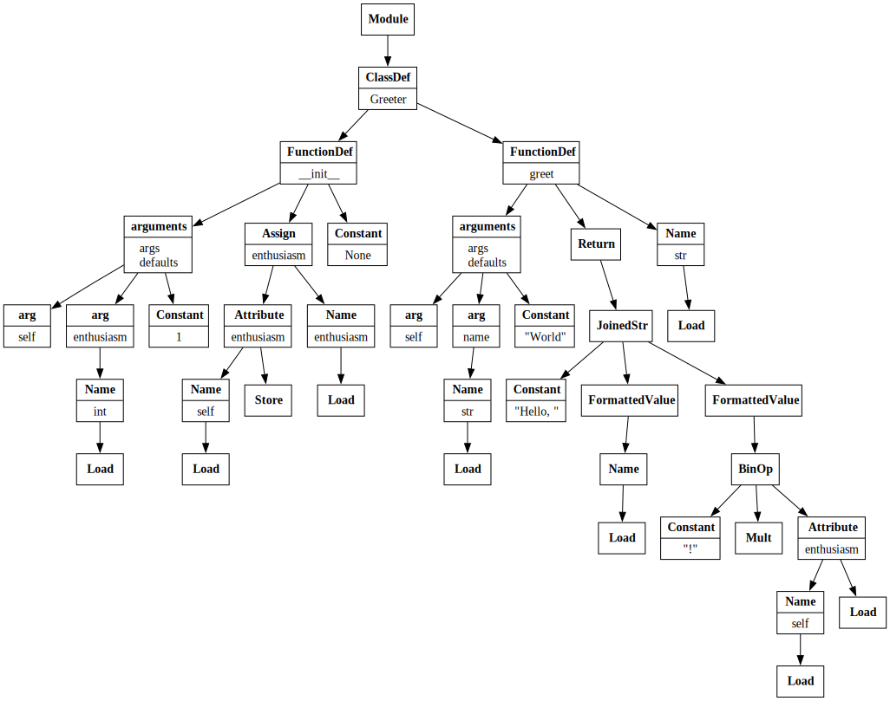
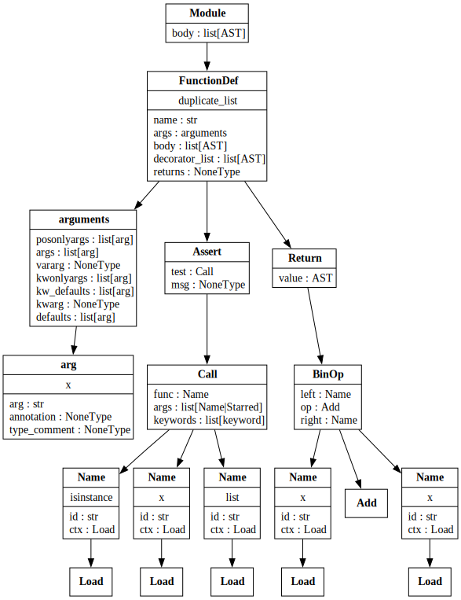
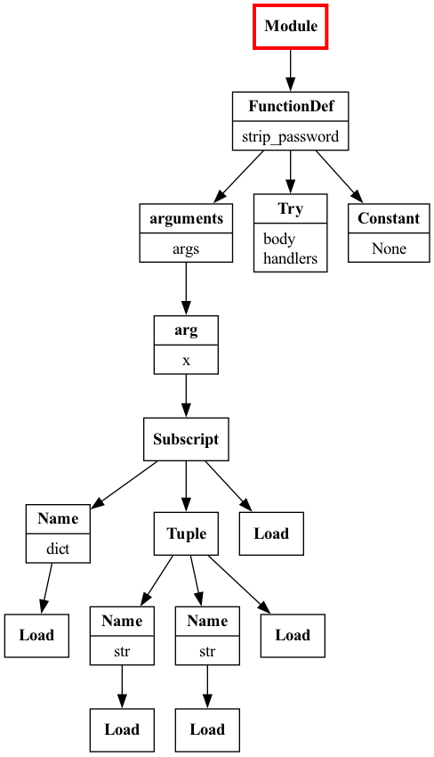
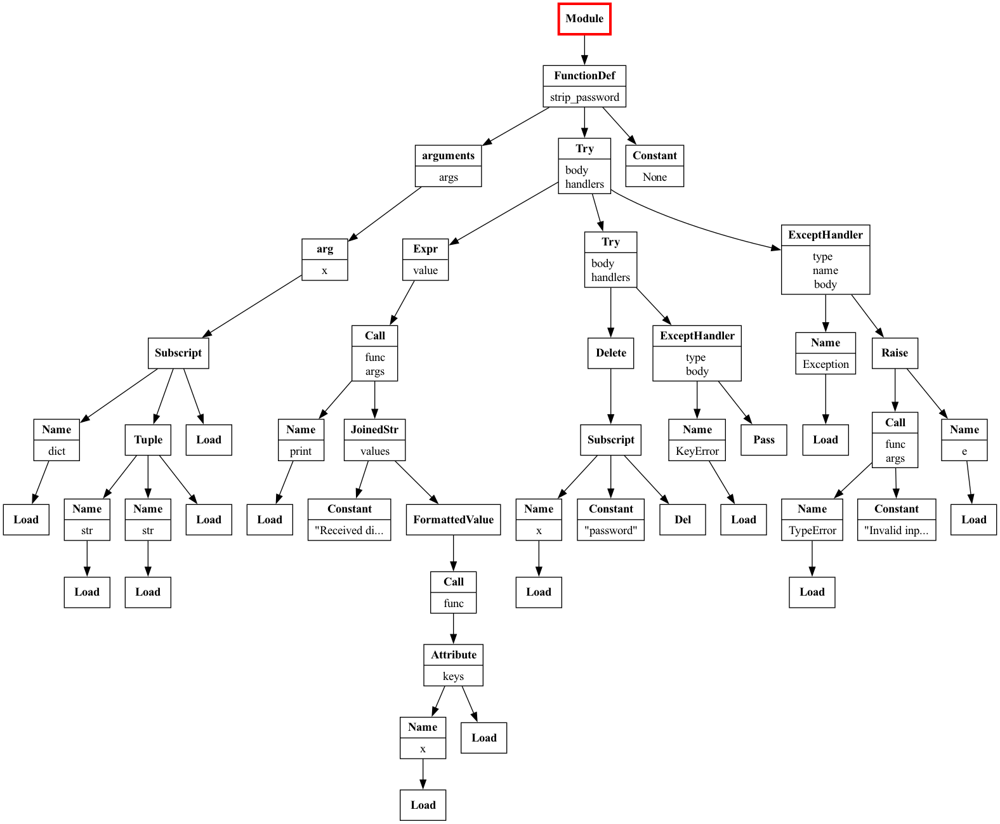

[id=bio]
## Bio

- 👩🏻‍💻 Software engineer at Bloomberg in NYC
- ✨ Core developer of [numpydoc](https://github.com/numpy/numpydoc) and creator of [numpydoc's pre-commit hook](https://numpydoc.readthedocs.io/en/latest/validation.html#docstring-validation-using-pre-commit-hook), which uses ASTs
- ✍ Author of "[Hands-On Data Analysis with Pandas](https://stefaniemolin.com/books/Hands-On-Data-Analysis-with-Pandas-2nd-edition/)"
- 🎓 Bachelor's degree in operations research from Columbia University
- 🎓 Master's degree in computer science from Georgia Tech

---

[id=prerequisites]
## Prerequisites

- Comfort writing Python code, especially object-oriented programming
- Have Python and Git installed on your computer, as well as a text editor for writing code (*e.g.*, [Visual Studio Code](https://code.visualstudio.com/))
- Fork and clone this repository: [github.com/stefmolin/ast-workshop](https://github.com/stefmolin/ast-workshop)
- Open up these slides in your browser and use the arrow keys to follow along: [stefaniemolin.com/ast-workshop](https://stefaniemolin.com/ast-workshop)
- Open up the documentation for the `ast` module in your browser to consult during the exercises: [docs.python.org/3/library/ast.html](https://docs.python.org/3/library/ast.html)

---

[id=agenda]
## Agenda

1. [Introduction to ASTs](#section-1)
2. [Working with ASTs](#section-2)
3. [Building an Import Linter](#section-3)

---

[id=section-1,class=section-intro-slide]
## Introduction to ASTs

---

### Abstract Syntax Tree (AST)

<ul>
  <li class="fragment fade-in">
    Represents the structure of the source code as a tree
  </li>
  <li class="fragment fade-in">
    Nodes in the tree are language constructs (<em>e.g.</em>, module, class, function)
  </li>
  <li class="fragment fade-in">
    Each node has a single parent (<em>e.g.</em>, a class is a child of a single module)
  </li>
  <li class="fragment fade-in">
    Parent nodes can have multiple children (<em>e.g.</em>, a class can have several methods)
  </li>
</ul>

---

[data-transition=slide-in fade-out]

Let's see what this code snippet (`greet.py`) looks like when represented as an AST:

```python
class Greeter:
    def __init__(self, enthusiasm: int = 1) -> None:
        self.enthusiasm = enthusiasm

    def greet(self, name: str = 'World') -> str:
        return f'Hello, {name}{"!" * self.enthusiasm}'
```

---

[data-transition=slide-out fade-in]
<div class="center">
  
  <br/>
  <small>The AST for the <code>greet.py</code> snippet visualized with Graphviz.</small>
</div>

---

### Popular open source tools that use ASTs

<ul>
  <li class="fragment fade-in">
    Linters and formatters, like <code>ruff</code> (Rust) and <code>black</code> (Python)
  </li>
  <li class="fragment fade-in">
    Documentation tools, like <code>sphinx</code> and the <code>numpydoc-validation</code> pre-commit hook
  </li>
  <li class="fragment fade-in">
    Automatic Python syntax upgrade tools, like <code>pyupgrade</code>
  </li>
  <li class="fragment fade-in">
    Next-generation notebooks, like <code>marimo</code>
  </li>
  <li class="fragment fade-in">
    Type checkers, like <code>mypy</code>
  </li>
  <li class="fragment fade-in">
    Code security tools, like <code>bandit</code>
  </li>
  <li class="fragment fade-in">
    Code and testing coverage tools, like <code>vulture</code> and <code>coverage.py</code>
  </li>
  <li class="fragment fade-in">
    Testing frameworks that instrument your code or generate tests based on it, like <code>hypothesis</code> and <code>pytest</code>
  </li>
</ul>

[notes]
Other potential use cases:

- Metaprogramming
- Updating syntax after upgrading dependency
- Analyzing code structure
- Forbidding certain imports or types of imports (like not allowing relative imports or `import *`)

---

### ASTs in Python

<ul>
  <li class="fragment fade-in">
    Represent syntactically-correct Python code (cannot be generated in the presence of syntax errors)
  </li>
  <li class="fragment fade-in">
    Created by the parser as an intermediary step when
    <a href="https://github.com/python/cpython/blob/main/InternalDocs/compiler.md">
      compiling source code into byte code
    </a> (necessary to run it)
  </li>
  <li class="fragment fade-in">
    Available in the standard library via the <code>ast</code> module
  </li>
</ul>

---

#### Parsing Python source code into an AST

---

##### 1. Read in the source code

```pycon
>>> from pathlib import Path
>>> source_code = Path('snippets/greet.py').read_text()
```

---

##### 2. Parse it with the `ast` module

If the code is syntactically-correct, we get an AST back:

```pycon
>>> import ast
>>> tree = ast.parse(source_code)
>>> print(type(tree))
<class 'ast.Module'>
```

---

#### Inspecting the AST

<div class="r-stack r-stack-left">
  <p class="fragment fade-out" data-fragment-index="0">
    We can use the <code>ast.dump()</code> function to display the AST:
  </p>
  <p class="fragment fade-in-then-out" data-fragment-index="0">
    The root node is an <code>ast.Module</code> node:
  </p>
  <p class="fragment fade-in-then-out" data-fragment-index="1">
    It contains everything else in its <code>body</code> attribute:
  </p>
  <p class="fragment fade-in-then-out" data-fragment-index="2">
    The <code>greet.py</code> file first defines a class, named <code>Greeter</code>:
  </p>
  <p class="fragment fade-in-then-out" data-fragment-index="3">
    The <code>ast.ClassDef</code> node also contains the <code>body</code> of the <code>Greeter</code> class:
  </p>
  <p class="fragment fade-in-then-out" data-fragment-index="4">
    The first entry is the <code>Greeter.__init__()</code> method:
  </p>
  <p class="fragment fade-in-then-out" data-fragment-index="5">
    The <code>ast.FunctionDef</code> node includes information about the arguments:
  </p>
  <p class="fragment fade-in-then-out" data-fragment-index="6">
    Its <code>body</code> contains the AST representation of the function's code:
  </p>
  <p class="fragment fade-in-then-out" data-fragment-index="7">
    The return annotation is stored in the <code>returns</code> attribute:
  </p>
  <p class="fragment fade-in-then-out" data-fragment-index="8">
    The final entry is the <code>Greeter.greet()</code> method:
  </p>
</div>

<pre>
    <code data-trim class="language-pycon hide-line-numbers" data-line-numbers="1|2|3-51|4-5|6-53|7-8|9-16|17-24|25|26-53" data-fragment-index="0">
>>> print(ast.dump(tree, indent=2))
Module(
  body=[
    ClassDef(
      name='Greeter',
      body=[
        FunctionDef(
          name='__init__',
          args=arguments(
            args=[
              arg(arg='self'),
              arg(
                arg='enthusiasm',
                annotation=Name(id='int', ctx=Load()))],
            defaults=[
              Constant(value=1)]),
          body=[
            Assign(
              targets=[
                Attribute(
                  value=Name(id='self', ctx=Load()),
                  attr='enthusiasm',
                  ctx=Store())],
              value=Name(id='enthusiasm', ctx=Load()))],
          returns=Constant(value=None)),
        FunctionDef(
          name='greet',
          args=arguments(
            args=[
              arg(arg='self'),
              arg(
                arg='name',
                annotation=Name(id='str', ctx=Load()))],
            defaults=[
              Constant(value='World')]),
          body=[
            Return(
              value=JoinedStr(
                values=[
                  Constant(value='Hello, '),
                  FormattedValue(
                    value=Name(id='name', ctx=Load()),
                    conversion=-1),
                  FormattedValue(
                    value=BinOp(
                      left=Constant(value='!'),
                      op=Mult(),
                      right=Attribute(
                        value=Name(id='self', ctx=Load()),
                        attr='enthusiasm',
                        ctx=Load())),
                    conversion=-1)]))],
          returns=Name(id='str', ctx=Load()))])])
</code>
</pre>

---

[id=exercise-1]
### Exercise 1

Try passing source code that has a `SyntaxError` into `ast.parse()`. What happens? What about if the code has an error unrelated to syntax, like a `NameError` or `TypeError`?

---

[id=example-solution-1]
### Example solution

---

#### Syntactically-incorrect source code

Let's use the following malformed `import` statement as an example of **invalid source code**:

```pycon
>>> import timedelta from datetime
  File "<stdin>", line 1
    import timedelta from datetime
    ^^^^^^^^^^^^^^^^^^^^^^^^^^^^^^
SyntaxError: Did you mean to use 'from ... import ...' instead?
```

---

We also encounter a `SyntaxError` when attempting to parse this into an AST:

```pycon [highlight-lines="1-2,14"][class="hide-line-numbers"]
>>> import ast
>>> tree = ast.parse('import timedelta from datetime')
Traceback (most recent call last):
  File "<stdin>", line 1, in <module>
    ast.parse('import timedelta from datetime')
    ~~~~~~~~~^^^^^^^^^^^^^^^^^^^^^^^^^^^^^^^^^^
  File ".../ast.py", line 46, in parse
    return compile(source, filename, mode, flags,
                   _feature_version=feature_version,
                   optimize=optimize)
  File "<unknown>", line 1
    ast.parse('import timedelta from datetime')
    ^^^^^^^^^^^^^^^^^^^^^^^^^^^^^^
SyntaxError: Did you mean to use 'from ... import ...' instead?
```

---

#### Syntactically-correct source code with logic errors

The following code raises a `NameError` at runtime:

```pycon
>>> a + 5
Traceback (most recent call last):
  File "<stdin>", line 1, in <module>
    a + 5
    ^
NameError: name 'a' is not defined
```

<div class="fragment">

<p>However, it is syntactically-correct, so we can parse it into an AST:<p>

```pycon
>>> ast.parse('a + 5')
Module(body=[Expr(value=BinOp(...))], type_ignores=[])
```

</div>

---

[id=section-2,class=section-intro-slide]
## Working with ASTs

---

### AST node attributes

In addition to being a highly-nested structure, attributes containing nodes may be named differently across node types. To see this, let's take a look at the AST for the following snippet in `assert.py`:

```python
def duplicate_list(x):
    assert isinstance(x, list)
    return x + x
```

---

[data-transition=slide-out fade-in]
<div class="center">
  
  <br/>
  <small>The AST for the <code>assert.py</code> snippet with node attributes visualized with Graphviz.</small>
</div>

---

### Traversing the AST

To effectively analyze code using the AST, we need to traverse it and inspect the nodes we care about. Depending on how much of the tree we want to explore and how much context we need about each node, there are different approaches. Let's walk through the different ways using the `assert.py` example:

```python
import ast
from pathlib import Path

source_code = Path('snippets/assert.py').read_text()
tree = ast.parse(source_code)
```

---

#### `ast.iter_fields()`

We can use the `ast.iter_fields()` function to iterate over all fields that a node has. Our AST is rooted at an `ast.Module` node, so there isn't much here:

```pycon
>>> print(list(ast.iter_fields(tree)))
[('body', [<ast.FunctionDef at 0x1086bea10>]),
 ('type_ignores', [])]
```

---

If we look at this for the `ast.FunctionDef` in the `body` of the `ast.Module`, we have more information:

```pycon
>>> func_def = tree.body[0]
>>> print(list(ast.iter_fields(func_def)))
[('name', 'duplicate_list'),
 ('args', <ast.arguments at 0x1085794e0>),
 ('body', [<ast.Assert at 0x10884d6c0>,
           <ast.Return at 0x10884d9f0>]),
 ('decorator_list', []),
 ('returns', None),
 ('type_comment', None)]
```

---

#### `ast.iter_child_nodes()`

The `ast.iter_fields()` function is helpful when figuring out how to work with individual node types. The `ast.iter_child_nodes()` builds on top of this to traverse the tree starting at a given node. It yields all nodes it encounters along the way that are *direct children* of the starting node (they can be in any field, but they cannot be grandchildren, like the children of the `ast.Assert` node below would be to the `ast.FunctionDef` node):

```pycon
>>> print(list(ast.iter_child_nodes(func_def)))
[<ast.arguments at 0x1085794e0>,
 <ast.Assert at 0x10884d6c0>,
 <ast.Return at 0x10884d9f0>]
```

---

To traverse the entire tree, we need the recursive behavior provided in the `ast.walk()` function or the `ast.NodeVisitor`/`ast.NodeTransformer` classes. Each of these builds upon the `ast.iter_fields()` and `ast.iter_child_nodes()` functions we just looked at. Let's start with the `ast.walk()` function.

---

#### `ast.walk()`

The `ast.walk()` function recursively yields all descendant nodes in the AST. Let's use it to make sure all `assert` calls provide a message when the `assert` is false and an `AssertionError` is raised. For those unfamiliar with the syntax, here's a comparison using the contents of the `assert.py` snippet:

```python
# without custom message
def duplicate_list(x):
    assert isinstance(x, list)
    return x + x

# with custom message
def duplicate_list(x):
    assert isinstance(x, list), 'Input is not a list'
    return x + x
```

---

##### Modifying code before running it with `ast.walk()`

<div class="r-stack r-stack-left">
  <p class="fragment fade-out" data-fragment-index="0">
    The <code>ast.walk()</code> function yields all nodes descending from <code>tree</code>:
  </p>
  <p class="fragment fade-in-then-out" data-fragment-index="0">
    We want to modify all <code>ast.Assert</code> nodes that do not have a message (<code>msg</code>):
  </p>
  <p class="fragment fade-in-then-out" data-fragment-index="1">
    We set the <code>msg</code> to a placeholder value, so it's easy to find in the logs:
  </p>
  <p class="fragment fade-in-then-out" data-fragment-index="2">
    All nodes to must have line numbers in order to compile the AST into a <code>code</code> object:
  </p>
  <p class="fragment fade-in-then-out" data-fragment-index="3">
    The <code>compile()</code> function turns our modified AST into a <code>code</code> object:
  </p>
  <p class="fragment fade-in-then-out" data-fragment-index="4">
    We can execute <code>code</code> objects with the <code>exec()</code> function:
  </p>
  <p class="fragment fade-in-then-out" data-fragment-index="5">
    This runs the function definition for <code>duplicate_list()</code>, so we can now call it:
  </p>
  <p class="fragment fade-in-then-out" data-fragment-index="6">
    The input we passed fails the <code>assert</code>, raising an <code>AssertionError</code>:
  </p>
  <p class="fragment fade-in-then-out" data-fragment-index="7">
    Notice that we get the message we injected when we modified the AST:
  </p>
</div>

<pre>
    <code data-trim class="language-pycon hide-line-numbers" data-line-numbers="1|2|3|4|6|7|8|9-14|3,14" data-fragment-index="0">
>>> for node in ast.walk(tree):
...     if isinstance(node, ast.Assert) and not node.msg:
...         node.msg = ast.Constant('TODO: Add failure info')
...         ast.fix_missing_locations(node)
>>>
>>> code = compile(tree, '&lt;ast_workshop&gt;', 'exec')
>>> exec(code)
>>> duplicate_list(1)
Traceback (most recent call last):
  File "&lt;stdin&gt;", line 1, in &lt;module&gt;
    duplicate_list(1)
    ~~~~~~~~~~~~~~^^^
  File "&lt;ast_workshop&gt;", line 3, in duplicate_list
AssertionError: TODO: Add failure info
</code></pre>

---

##### Can we convert this back into source code to save it?

With a small example like this, we can also use the `ast.unparse()` function to convert the modified AST back into Python source code:

```pycon [highlight-lines="1|2-4|3"][class="hide-line-numbers"]
>>> print(ast.unparse(tree))
def duplicate_list(x):
    assert isinstance(x, list), 'TODO: Add failure info'
    return x + x
```

---

The `ast.unparse()` function comes with some caveats:

<ul>
    <li class="fragment">It's not recommended with larger trees since it can hit recursion limits.</li>
    <li class="fragment">If we first convert source code to an AST, and then attempt to convert it back without an changes, the result will be <em>equivalent, but not necessarily equal</em> to the original.</li>
</ul>

---

One way that the round-trip could result in equivalent, but different source code is in the presence of non-code elements like comments and stylistic formatting. These aren't part of the AST because they have no effect on the logic of the program. For example, consider this code, which has both:

```python
import contextlib


def strip_password(
    credentials: dict[str, str]
) -> None:
    '''
    Strip out the password from the credentials.
    '''

    # remove the password if it is there
    with contextlib.suppress(KeyError):
        del credentials["password"]
```

---

When we parse this into an AST and back again, the code is equivalent, but different:

```python
import contextlib

def strip_password(credentials: dict[str, str]) -> None:
    """
    Strip out the password from the credentials.
    """
    with contextlib.suppress(KeyError):
        del credentials['password']
```

---

<div class="r-stack r-stack-left">
  <p class="fragment fade-out" data-fragment-index="0">
    There are no longer two blank lines after the import:
  </p>
  <p class="fragment fade-in-then-out" data-fragment-index="0">
    The function definition is now written entirely on one line:
  </p>
  <p class="fragment fade-in-then-out" data-fragment-index="1">
    The docstring now uses <code>"""</code> instead of <code>'''</code>:
  </p>
  <p class="fragment fade-in-then-out" data-fragment-index="2">
    There is no longer a blank line between the docstring and the code:
  </p>
  <p class="fragment fade-in-then-out" data-fragment-index="3">
    The comment has been removed:
  </p>
  <p class="fragment fade-in-then-out" data-fragment-index="4">
    Single quotes are used for keying into the dictionary:
  </p>
</div>

<div>
<pre>
    <code data-trim class="language-diff hide-line-numbers" data-line-numbers="1-3|4-7|8-12|12-13|14|16-17" data-fragment-index="0">

  import contextlib

-
- def strip_password(
+ def strip_password(credentials: dict[str, str]) -> None:
-     credentials: dict[str, str]
- ) -> None:
-     '''
+     """
      Strip out the password from the credentials.
-     '''
+     """
-
-     # remove the password if it is there
      with contextlib.suppress(KeyError):
-         del credentials["password"]
+         del credentials['password']
    </code>
</pre>
</div>

---

[id=exercise-2]
### Exercise 2

Use the `ast.walk()` function and the `ast.get_docstring()` function to traverse the AST for the `greet.py` snippet and report any items that are missing docstrings.

---

[id=example-solution-2]
### Example solution

<div class="r-stack r-stack-left">
  <p class="fragment fade-out" data-fragment-index="0">
    Similar setup to the previous examples, except we also import <code>contextlib</code>:
  </p>
  <p class="fragment fade-in-then-out" data-fragment-index="0">
    Multiple node types can have docstrings, so we don't limit to a type here:
  </p>
  <p class="fragment fade-in-then-out" data-fragment-index="1">
    We try to access each node's docstring and <code>suppress</code> any <code>TypeErrors</code>:
  </p>
  <p class="fragment fade-in-then-out" data-fragment-index="2">
    If there isn't a docstring on a node that can have one, we report it:
  </p>
  <p class="fragment fade-in-then-out" data-fragment-index="3">
    The module, <code>Greeter</code> class, and the <code>Greeter</code> class's methods lack docstrings:
  </p>
</div>

<div>
<pre>
    <code data-trim class="language-python hide-line-numbers" data-line-numbers="1-3,5|6-9|2,7|8-9|10-13" data-fragment-index="0">
>>> import ast
>>> import contextlib
>>> from pathlib import Path
>>>
>>> tree = ast.parse(Path('snippets/greet.py').read_text())
>>> for node in ast.walk(tree):
...    with contextlib.suppress(TypeError):
...        if not ast.get_docstring(node):
...            print(getattr(node, 'name', 'module'))
module
Greeter
__init__
greet
</code></pre>

---

The `ast.walk()` function yields the nodes in no specific order, so we don't have context beyond the node itself. In the case of the previous exercise, larger files can easily make the results confusing. Furthermore, we may want to flag missing docstrings on the `__init__()` method only if the class doesn't have one. For these use cases, we need the context provided by traversing the tree in a specific order.

---

### Depth-first traversal

The `ast` module provides two classes that perform depth-first traversal of an AST:

<ul>
    <li class="fragment"><code>ast.NodeVisitor</code>: visits nodes in an AST</li>
    <li class="fragment"><code>ast.NodeTransformer</code>: special version of the above that can also modify nodes</li>
</ul>

---

### `ast.NodeVisitor`

When we subclass `ast.NodeVisitor`, we create `visit_<NodeType>()` methods for each AST node we want to visit, and the `ast.NodeVisitor` will take care of calling them as nodes of that type are encountered.

---

Suppose we want to check our code for the following `try`/`except`/`pass` anti-pattern like the following code from the `try_except.py` snippet:

```python
def strip_password(x: dict[str, str]) -> None:
    try:
        del x['password']
    except KeyError:
        pass
```

<div class="fragment">

<p>Instead, we want to encourage the use of <code>contextlib.suppress()</code>:</p>

```python
import contextlib

def strip_password(x: dict[str, str]) -> None:
    with contextlib.suppress(KeyError):
        del x['password']
```

</div>

---

We need to visit each `ast.Try` node and inspect its `handlers` &ndash; if there is only one handler and its `body` is an `ast.Pass` node then we will report it:

```python [highlight-lines="1-12|4|5-12|6-8"][class="hide-line-numbers"]
import ast


class TryExceptVisitor(ast.NodeVisitor):
    def visit_Try(self, node):
        if len(node.handlers) == 1 and isinstance(
            node.handlers[0].body[-1], ast.Pass
        ):
            print(
                'try/except/pass block on line',
                f'{node.lineno}, use contextlib.suppress',
            )
```

---

To use our visitor, we instantiate it and call its `visit()` method, passing in the AST, to start the traversal:

```pycon [highlight-lines="1-7|5|6|7"][class="hide-line-numbers"]
>>> from pathlib import Path
>>>
>>> source_code = Path('snippets/try_except.py').read_text()
>>> tree = ast.parse(source_code)
>>> visitor = TryExceptVisitor()
>>> visitor.visit(tree)
try/except/pass block on line 3, use contextlib.suppress
```

---

We aren't done yet though. The `visit_Try()` method is currently cutting off the traversal to descendants of `ast.Try` nodes, meaning our visitor never visits nested `try` blocks (only the outermost one). Consider this example of nested `try` blocks from the `try_except_nested.py` snippet, where we want to detect the anti-pattern in the inner `try`:

```python [highlight-lines="1-9|4-7"][class="hide-line-numbers"]
def strip_password(x: dict[str, str]) -> None:
    try:
        print(f'Received dict with keys: {x.keys()}')
        try:
            del x['password']
        except KeyError:
            pass
    except Exception as e:
        raise TypeError('Invalid input, expected dict') from e
```

---

The `TryExceptVisitor` doesn't find anything with this input because it doesn't go any deeper after it visits the outermost `try`:

```pycon
>>> source_code = Path('snippets/try_except_nested.py')
>>> tree = ast.parse(source_code.read_text())
>>> visitor = TryExceptVisitor()
>>> visitor.visit(tree)
```

---

[data-transition=slide-out fade-in]
<div class="center">
  
  <br/>
  <small>Partial AST traversal of the <code>try_except_nested.py</code> snippet with the initial <code>TryExceptVisitor</code> visualized with Graphviz.</small>
</div>

---

### The `generic_visit()` method

When we don't define a dedicated `visit_<NodeType>()` method for an AST node, the `ast.NodeVisitor` calls the `generic_visit()` method, which continues the traversal. The `visit_Try()` method we defined does not currently call `generic_visit()` on that node, so the traversal does not go any deeper.

---

We need to call `generic_visit()` ourselves. Note the indentation level &ndash; it is outside of the `if` because we want to visit all nodes, regardless of whether their ancestors had the issue we are looking for:

```python [highlight-lines="13"][class="hide-line-numbers"]
import ast


class TryExceptVisitor(ast.NodeVisitor):
    def visit_Try(self, node):
        if len(node.handlers) == 1 and isinstance(
            node.handlers[0].body[-1], ast.Pass
        ):
            print(
                'try/except/pass block on line',
                f'{node.lineno}, use contextlib.suppress',
            )
        self.generic_visit(node)
```

---

The `TryExceptVisitor` now visits the innermost `try` and detects the issue:

```pycon [highlight-lines="4"][class="hide-line-numbers"]
>>> tree = ast.parse(source_code.read_text())
>>> visitor = TryExceptVisitor()
>>> visitor.visit(tree)
try/except/pass block on line 5, use contextlib.suppress
```

---

[data-transition=slide-out fade-in]
<div class="center">
  
  <br/>
  <small>Full AST traversal of the <code>try_except_nested.py</code> snippet visualized with Graphviz.</small>
</div>

---

[id=exercise-3]
### Exercise 3

Create a `GenericExceptionVisitor` class that detects both bare `except` blocks and the usage of generic `Exceptions`. Your visitor will need to visit both `ast.Raise` and `ast.ExceptionHandler` nodes. You can test it using the source code in the `generic_exception.py` snippet:

```python
try:
    del x['non_existent_key']
except:  # bare except
    raise Exception('No such key')  # generic Exception
```

**Bonus**: If you have time, use the `ast.get_source_segment()` function to print any problematic code you detect.

---

[id=example-solution-3]
### Example solution


<div class="r-stack r-stack-left">
  <p class="fragment fade-out" data-fragment-index="0">
    In addition to <code>ast</code>, we will also use <code>textwrap</code> for text formatting:
  </p>
  <p class="fragment fade-in-then-out" data-fragment-index="0">
    We start by inheriting from <code>ast.NodeVisitor</code>:
  </p>
  <p class="fragment fade-in-then-out" data-fragment-index="1">
    In order to use <code>ast.get_source_segment()</code>, we need the source code string:
  </p>
  <p class="fragment fade-in-then-out" data-fragment-index="2">
    <code>_print_source_segment()</code> will print the source code we reference:
  </p>
  <p class="fragment fade-in-then-out" data-fragment-index="3">
    <code>ast.get_source_segment()</code> needs the full source code and the AST node:
  </p>
  <p class="fragment fade-in-then-out" data-fragment-index="4">
    <code>visit_Raise()</code> defines our actions when we encounter <code>ast.Raise</code> nodes:
  </p>
  <p class="fragment fade-in-then-out" data-fragment-index="5">
    Here, we look for <code>raise Exception</code>:
  </p>
  <p class="fragment fade-in-then-out" data-fragment-index="6">
    or <code>raise Exception(...)</code>:
  </p>
  <p class="fragment fade-in-then-out" data-fragment-index="7">
    If either is true, we print the issue, line number, and the code itself for reference:
  </p>
  <p class="fragment fade-in-then-out" data-fragment-index="8">
    Regardless of whether we found something, we make sure to continue the traversal:
  </p>
  <p class="fragment fade-in-then-out" data-fragment-index="9">
    We also need to visit <code>ast.ExceptHandler</code> nodes:
  </p>
  <p class="fragment fade-in-then-out" data-fragment-index="10">
    With a bare <code>except</code>, there is no exception type provided in <code>node.type</code>:
  </p>
  <p class="fragment fade-in-then-out" data-fragment-index="11">
    With a generic exception, the exception type provided is <code>Exception</code>:
  </p>
  <p class="fragment fade-in-then-out" data-fragment-index="12">
    Again, regardless of whether we found something, we continue the traversal:
  </p>
  <p class="fragment fade-in-then-out" data-fragment-index="13">
    We generated the AST in <code>__init__()</code>, so we create <code>run()</code> to call <code>visit()</code>:
  </p>
</div>

<div>
<pre>
    <code data-trim class="language-python hide-line-numbers" data-line-numbers="1-2|5|6-8|10-14|11-13|16-33|18-21|22-25|27-31|33|35-44|36-38|40-42|44|46-47" data-fragment-index="0">
import ast
from textwrap import dedent, indent


class GenericExceptionVisitor(ast.NodeVisitor):
    def __init__(self, source_code):
        self.source_code = source_code
        self.tree = ast.parse(source_code)

    def _print_source_segment(self, node):
        code_segment = ast.get_source_segment(
            self.source_code, node, padded=True
        )
        print(indent(dedent(code_segment), '| '), end='\n\n')

    def visit_Raise(self, node):
        if (
            (
                isinstance(node.exc, ast.Name)
                and node.exc.id == 'Exception'
            )
            or (
                isinstance(node.exc, ast.Call)
                and node.exc.func.id == 'Exception'
            )
        ):
            print(
                'Generic Exception raised on line',
                f'{node.lineno}:'
            )
            self._print_source_segment(node)

        self.generic_visit(node)

    def visit_ExceptHandler(self, node):
        if not (exception_type := node.type):
            print(f'Bare except on line {node.lineno}:')
            self._print_source_segment(node)

        elif exception_type.id == 'Exception':
            print(f'Generic Exception on line {node.lineno}:')
            self._print_source_segment(node)

        self.generic_visit(node)

    def run(self):
        self.visit(self.tree)
</code></pre>

---

Using the `GenericExceptionVisitor` is a little different. This time, we pass in the source code when we initialize it, and we call the `run()` method to kick off the traversal:

```pycon [highlight-lines="1-7|8-25"][class="hide-line-numbers"]
>>> from pathlib import Path
>>>
>>> source_code = Path('snippets/generic_exception.py')
>>> visitor = GenericExceptionVisitor(
...     source_code.read_text()
... )
>>> visitor.run()
Bare except on line 5:
| except:
|     pass

Generic Exception on line 11:
| except Exception:
|     pass

Generic Exception raised on line 16:
| raise Exception('Improper input format')

Generic Exception raised on line 20:
| raise Exception

Bare except on line 25:
| except:
|     print('Shame on you!')
|     raise
```

---

### `ast.NodeTransformer`

The `ast.NodeTransformer` performs the traversal in the same way that the `ast.NodeVisitor` does, but it can modify the AST. So far, each of our `visit_*()` methods haven't returned anything (implicitly, they return `None`). However, with the `ast.NodeTransformer`, the return value modifies the AST:

- Returning `None` deletes the subtree rooted at that node (*i.e.*, that node and all of its descendants)
- Returning `transformed_node` replaces the subtree rooted at the visited node with `transformed_node` (or keeps it if it wasn't modified)

---

Circling back to our `try`/`except`/`pass` detector, we can create a `ast.NodeTransformer` to rewrite that code to use `contextlib.suppress()` instead of just suggesting it:

<div class="fragment semi-fade-out" data-fragment-index="0">

```python
def strip_password(x: dict[str, str]) -> None:
    try:
        del x['password']
    except KeyError:
        pass
```

</div>

<div class="fragment fade-in-then-semi-out" data-fragment-index="0">

```python
import contextlib

def strip_password(x: dict[str, str]) -> None:
    with contextlib.suppress(KeyError):
        del x['password']
```

</div>

---

<div class="r-stack r-stack-left">
  <p class="fragment fade-out" data-fragment-index="0">
    Once again, we will use the <code>ast</code> module along with <code>textwrap</code>:
  </p>
  <p class="fragment fade-in-then-out" data-fragment-index="0">
    We start by inheriting from <code>ast.NodeTransformer</code>:
  </p>
  <p class="fragment fade-in-then-out" data-fragment-index="1">
    <code>has_changed</code> indicates whether we need to add an import for <code>contextlib</code>:
  </p>
  <p class="fragment fade-in-then-out" data-fragment-index="2">
    <code>_get_suppress_block()</code> will take a <code>ast.Try</code> node and convert it:
  </p>
  <p class="fragment fade-in-then-out" data-fragment-index="3">
    Rather than write the AST directly, we will write source code, parse it, then edit it:
  </p>
  <p class="fragment fade-in-then-out" data-fragment-index="4">
    We <code>suppress()</code> the type of exception that was in the <code>except</code>:
  </p>
  <p class="fragment fade-in-then-out" data-fragment-index="5">
    The body of the <code>with</code> block will be the code that was in the body of the <code>try</code>:
  </p>
  <p class="fragment fade-in-then-out" data-fragment-index="6">
    Finally, we return this new node so that we can update the AST:
  </p>
  <p class="fragment fade-in-then-out" data-fragment-index="7">
    The <code>ast.NodeTransformer</code> will call our <code>visit_Try()</code> method during traversal:
  </p>
  <p class="fragment fade-in-then-out" data-fragment-index="8">
    If it finds a <code>try</code> block to rewrite, it will report it and start the AST update:
  </p>
  <p class="fragment fade-in-then-out" data-fragment-index="9">
    We track the change and call <code>_get_suppress_block()</code> to get the new node:
  </p>
  <p class="fragment fade-in-then-out" data-fragment-index="10">
    We still need to traverse the tree further in case there are any nested blocks:
  </p>
  <p class="fragment fade-in-then-out" data-fragment-index="11">
    By returning the new node, the <code>try</code> block is replaced by the new <code>with</code> block:
  </p>
  <p class="fragment fade-in-then-out" data-fragment-index="12">
    Again, we create a <code>run()</code> method as the entrypoint:
  </p>
  <p class="fragment fade-in-then-out" data-fragment-index="13">
    We start by calling <code>visit()</code> to traverse the entire AST:
  </p>
  <p class="fragment fade-in-then-out" data-fragment-index="14">
    If any edits were made, we will add <code>import contextlib</code> to the top of the module:
  </p>
  <p class="fragment fade-in-then-out" data-fragment-index="15">
    We return the modified AST with all the location information required to compile:
  </p>
</div>

<div>
<pre>
    <code data-trim class="language-python hide-line-numbers" data-line-numbers="1-2|5|6-8|10-20|10-15|16-18|19|20|22-34|23-32|31-32|33|34|36-43|37|38-42|43" data-fragment-index="0">
import ast
from textwrap import dedent


class TryExceptTransformer(ast.NodeTransformer):
    def __init__(self, source_code):
        self.tree = ast.parse(source_code)
        self.has_changed = False

    def _get_suppress_block(self, node):
        suppress_example = dedent("""
        with contextlib.suppress(KeyError):
            del x['password']
        """)
        with_block = ast.parse(suppress_example).body[0]
        with_block.items[0].context_expr.args = [
            node.handlers[0].type or ast.Name('Exception')
        ]
        with_block.body = node.body
        return with_block

    def visit_Try(self, node):
        if (
            len(node.handlers) == 1
            and isinstance(node.handlers[0].body[-1], ast.Pass)
        ):
            print(
                'Detected a try/except/pass block on',
                f'line {node.lineno}, rewriting'
            )
            self.has_changed = True
            node = self._get_suppress_block(node)
        self.generic_visit(node)
        return node

    def run(self):
        result = self.visit(self.tree)
        if self.has_changed:
            self.tree.body = (
                [ast.Import([ast.alias('contextlib')])]
                + self.tree.body
            )
        return ast.fix_missing_locations(result)
</code></pre>

---


We can use the `TryExceptTransformer` on the `try_except.py` snippet to generate the modified AST. Remember that using `ast.unparse()` may result in other changes to the code, like the loss of comments and formatting:

```pycon [highlight-lines="1-6|7|8-12"][class="hide-line-numbers"]
>>> import ast
>>> from pathlib import Path
>>>
>>> source_code = Path('snippets/try_except.py')
>>> transformer = TryExceptTransformer(source_code)
>>> updated_ast = transformer.run()
>>> print(ast.unparse(updated_ast))
import contextlib

def strip_password(x: dict[str, str]) -> None:
    with contextlib.suppress(KeyError):
        del x['password']
```

<p class="fragment"><em>Note that, in order to simplify the code, we didn't check if there was already an import of <code>contextlib</code> or even the <code>suppress()</code> function, but you could do that as well.</em><p>

---

[id=exercise-4]
### Exercise 4

Create an `ast.NodeTransformer` to add placeholder messages to all `assert` calls that don't have them. We did this earlier with `ast.walk()`, and this will look very similar. We want to visit the `ast.Assert` nodes and check for the presence of a message (available in the `msg` attribute). Don't forget to return the node after visiting it, or it will be removed from the tree.

---

[id=example-solution-4]
### Example solution

```python
import ast


class AssertTransformer(ast.NodeTransformer):
    def visit_Assert(self, node):
        if not node.msg:
            node.msg = ast.Constant('TODO: Add failure info')
            ast.fix_missing_locations(node)
        self.generic_visit(node)
        return node
```

---

[id=section-3,class=section-intro-slide]
## Building an Import Linter

---

### Managing context during traversal

Up until this point, we were only concerned with a node and its immediate children, but sometimes we need to understand a node's ancestry (*i.e.*, parents, grandparents, *etc.*), which, since nodes don't hold references to their parents, is not possible without some extra accounting on our end. One such case is taking into account what is in scope (variables, imports, *etc.*) when processing nodes.

<p class="fragment">In this section, we will learn how to track this information as we build an import linter capable of flagging unused imports, along with masked and missing names.</p>

---

### Finding all imports

<div class="r-stack r-stack-left">
  <p class="fragment fade-out" data-fragment-index="0">
    Let's start by finding all the imports in a module with a new <code>ImportVisitor</code>:
  </p>
  <p class="fragment fade-in-then-out" data-fragment-index="0">
    We start by importing <code>ast</code> and inheriting from <code>ast.NodeVisitor</code>:
  </p>
  <p class="fragment fade-in-then-out" data-fragment-index="1">
    We will track imports in the <code>imports_available</code> list:
  </p>
  <p class="fragment fade-in-then-out" data-fragment-index="2">
    We will be visiting both <code>ast.Import</code> and <code>ast.ImportFrom</code> nodes:
  </p>
  <p class="fragment fade-in-then-out" data-fragment-index="3">
    In both cases, we will track the import in the same way, so we add a helper method:
  </p>
  <p class="fragment fade-in-then-out" data-fragment-index="4">
    Each <code>import</code> statement can import multiple names, so we loop over them:
  </p>
  <p class="fragment fade-in-then-out" data-fragment-index="5">
    We will ignore any <code>from x import *</code> imports as a simplification:
  </p>
  <p class="fragment fade-in-then-out" data-fragment-index="6">
    For each named import, we track its name and alias (if any), along with its module:
  </p>
  <p class="fragment fade-in-then-out" data-fragment-index="7">
    We use <code>getattr()</code> here because this is only for <code>ast.ImportFrom</code> nodes:
  </p>
  <p class="fragment fade-in-then-out" data-fragment-index="8">
    We add the imports extracted from the node to <code>imports_available</code>:
  </p>
  <p class="fragment fade-in-then-out" data-fragment-index="9">
    As we have seen before, we call <code>generic_visit()</code> to continue the traversal:
  </p>
  <p class="fragment fade-in-then-out" data-fragment-index="10">
    Last, we have the initial version of our <code>run()</code> method, which just calls <code>visit()</code>:
  </p>
</div>

<div>
<pre>
    <code data-trim class="language-python hide-line-numbers" data-line-numbers="1-31|1-4|5-8|24-28|10-22|18|19|13-17|15|11-21|22|30-31" data-fragment-index="0">
import ast


class ImportVisitor(ast.NodeVisitor):
    def __init__(self, source_code):
        self.source_code = source_code
        self.tree = ast.parse(source_code)
        self.imports_available = []

    def _visit_import(self, node):
        self.imports_available.extend(
            [
                {
                    'import': alias.name,
                    'from': getattr(node, 'module', None),
                    'alias': alias.asname,
                }
                for alias in node.names
                if alias.name != '*'
            ]
        )
        self.generic_visit(node)

    def visit_Import(self, node):
        self._visit_import(node)

    def visit_ImportFrom(self, node):
        self._visit_import(node)

    def run(self):
        self.visit(self.tree)
</code></pre>

---

Let's try this out on the `imports.py` snippet, which has one import of each case we need to handle. Notice we have module-level imports and imports inside functions:

```python [highlight-lines="1-17|1|2|15"][class="hide-line-numbers"]
import json
from contextlib import suppress


def strip_password(x):
    with suppress(KeyError):
        del x['password']


def dump_info(x, out):
    json.dump(strip_password(x), out)


def analyze_something(x):
    import pandas as pd

    df = pd.DataFrame(x)
```

---

Our `ImportVisitor` finds each of the imports:

```pycon [highlight-lines="1-8|1-2|3-4|5|6-8"][class="hide-line-numbers"]
>>> from pathlib import Path
>>> source_code = Path('snippets/imports.py').read_text()
>>> visitor = ImportVisitor(source_code)
>>> visitor.run()
>>> print(visitor.imports_available)
[{'import': 'json', 'from': None, 'alias': None},
 {'import': 'suppress', 'from': 'contextlib', 'alias': None},
 {'import': 'pandas', 'from': None, 'alias': 'pd'}]
```

---

### Tracking import scope

In order to flag missing names and unused imports, we need to know which imports are available to us. However, right now, we don't have the full story &ndash; we need to account for their scope. For example, the import of `json` on line 2, is only available with the scope of the `get_data()` function, which is narrower than the module scope, in which we call `json.dump()` on line 8:

```python [highlight-lines="1-8"]
def get_data():
    import json
    return json.loads('{"key": "value"}')

data = get_data()

# this results in a NameError
json.dump(data, 'data.json')
```

---

#### Using a stack to track scope

<div class="r-stack r-stack-left">
  <p class="fragment fade-out" data-fragment-index="0">
    Let's update our <code>ImportVisitor</code> to track import scope:
  </p>
  <p class="fragment fade-in-then-out" data-fragment-index="0">
    Our <code>__init__()</code> method now initializes a stack for tracking the ancestry:
  </p>
  <p class="fragment fade-in-then-out" data-fragment-index="1">
    Each time we visit an import node, we will now record the scope:
  </p>
  <p class="fragment fade-in-then-out" data-fragment-index="2">
    A node's scope is the path to it from the root of the tree:
  </p>
  <p class="fragment fade-in-then-out" data-fragment-index="3">
    We will override the <code>generic_visit()</code> method to keep the stack up-to-date:
  </p>
  <p class="fragment fade-in-then-out" data-fragment-index="4">
    Each time we visit a node that has a <code>body</code> attribute, our scope changes:
  </p>
  <p class="fragment fade-in-then-out" data-fragment-index="5">
    We call the superclass's <code>generic_visit()</code> method to continue the traversal:
  </p>
  <p class="fragment fade-in-then-out" data-fragment-index="6">
    Afterward, we remove the node from the stack (remember, this is depth first):
  </p>
</div>

<div>
<pre>
    <code data-trim class="language-python hide-line-numbers" data-line-numbers="1-41|5,9|11-25|12,16|33-38|34-35|36|37-38" data-fragment-index="0">
import ast


class ImportVisitor(ast.NodeVisitor):
    def __init__(self, source_code):
        self.source_code = source_code
        self.tree = ast.parse(source_code)
        self.imports_available = []
        self.stack = []

    def _visit_import(self, node):
        import_scope = '.'.join(self.stack)
        self.imports_available.extend(
            [
                {
                    'scope': import_scope,
                    'import': alias.name,
                    'from': getattr(node, 'module', None),
                    'alias': alias.asname,
                }
                for alias in node.names
                if alias.name != '*'
            ]
        )
        self.generic_visit(node)

    def visit_Import(self, node):
        self._visit_import(node)

    def visit_ImportFrom(self, node):
        self._visit_import(node)

    def generic_visit(self, node):
        if hasattr(node, 'body'):
            self.stack.append(getattr(node, 'name', 'module'))
        super().generic_visit(node)
        if hasattr(node, 'body'):
            self.stack.pop()

    def run(self):
        self.visit(self.tree)
</code></pre>

---

Now the `ImportVisitor` includes the scope in which each of the imports can be used, and we are one step closer to detecting missing names and unused imports:

```pycon [highlight-lines="4-9|4,6,8"][class="hide-line-numbers"]
>>> visitor = ImportVisitor(source_code)
>>> visitor.run()
>>> print(visitor.imports_available)
[{'scope': 'module',
  'import': 'json', 'from': None, 'alias': None},
 {'scope': 'module',
  'import': 'suppress', 'from': 'contextlib', 'alias': None},
 {'scope': 'module.analyze_something',
  'import': 'pandas', 'from': None, 'alias': 'pd'}]
```

---

#### What's currently in scope?

As we explore the AST, we need to be able to determine both which imports and which names (*e.g.*, variables, function definitions) are in scope. An import is in the current scope if its scope matches the current scope or is a prefix of it.

|import scope|current scope|is in scope?|
|---|---|---|---|
| `module` | `module` | True |
| `module` | `module.function` | True |
| `module` | `module.function.with` | True |
| `module.function` | `module` | False |
| `module.function` | `module.function.with` | True |

---

[id=exercise-5]
### Exercise 5

Starting from `checkpoints/exercise_5.py`, write the following methods for the `ImportVisitor` class to add the functionality to determine which imports are in scope given the current state of the stack during traversal:

- `_is_in_scope(self, definition_scope: str) -> bool`, which given an import's scope (`definition_scope`) will return whether it is currently in scope (using the stack)
- `get_in_scope_import(self, name: str) -> dict | None`, which will filter the `imports_available` list down to the import of `name` that is currently in scope by calling `_is_in_scope()` and breaking ties by selecting the narrowest scope (*e.g.*, `module.x` is narrower than `module`)

*Note: We will be using `_is_in_scope()` later for checking whether other names are in scope, so don't pass in the full import dictionary inside `imports_available`.*

---

[id=example-solution-5]
### Example solution

The `definition_scope` is in scope if the stack starts with that path. We slice the stack and compare the lists for equality instead of comparing strings to avoid any false-positives (*e.g.*, `module.a` is a substring of `module.abc`, but they have different scopes):

```python
def _is_in_scope(self, definition_scope: str) -> bool:
    check_scope = definition_scope.split('.')
    return self.stack[: len(check_scope)] == check_scope
```

---


<div class="r-stack r-stack-left">
  <p class="fragment fade-out" data-fragment-index="0">
    The <code>get_in_scope_import()</code> method uses <code>_is_in_scope()</code> to filter imports:
  </p>
  <p class="fragment fade-in-then-out" data-fragment-index="0">
    First, we grab all imports of <code>name</code> that are in scope:
  </p>
  <p class="fragment fade-in-then-out" data-fragment-index="1">
    If nothing is in scope, we return <code>None</code>:
  </p>
  <p class="fragment fade-in-then-out" data-fragment-index="2">
    Otherwise, we take the narrowest scope (more dots, means deeper in the stack):
  </p>
</div>

<div>
<pre>
    <code data-trim class="language-python hide-line-numbers" data-line-numbers="1-16|2-9|11-12|14-16" data-fragment-index="0">
def get_in_scope_import(self, name: str) -> dict | None:
    scoped_imports = [
        import_info
        for import_info in self.imports_available
        if self._is_in_scope(import_info['scope'])
        and name == (
            import_info['alias'] or import_info['import']
        )
    ]

    if not scoped_imports:
        return None

    return max(
        scoped_imports, key=lambda x: x['scope'].count('.')
    )
</code></pre>

---

### Tracking name definitions

As alluded to before, in order to see if an import is missing, we also need to track all the names used and the scopes in which they were defined. Imports, class definitions, function definitions, function arguments, and variable assignments are all names. Think about what happens if you try to run `ast.parse()` without first running `import ast` &ndash; you get a `NameError`:

```pycon
>>> ast.parse('x = 1')
Traceback (most recent call last):
  File "<stdin>", line 1, in <module>
    ast.parse('x=1')
    ^^^
NameError: name 'ast' is not defined. Did you forget to import 'ast'?
```

---

We will use a `defaultdict` to track names, where the key is the name we find in the source code we are processing, and the value is a list of dictionaries that each contain the scope upon declaration, the type of name it is (*e.g.*, builtin, import, *etc.*), and the line number (if not a builtin):

```python [highlight-lines="2,3|12-21"][class="hide-line-numbers"]
import ast
import builtins
from collections import defaultdict


class ImportVisitor(ast.NodeVisitor):
    def __init__(self, source_code: str) -> None:
        self.source_code = source_code
        self.tree = ast.parse(source_code)
        self.stack = []
        self.imports_available = []
        self.names_defined = defaultdict(list)

        for builtin in builtins.__dict__.keys():
            self.names_defined[builtin].append(
                {
                    'scope': 'module',
                    'type': 'builtin',
                    'line_number': None,
                }
            )
    ...
```

---

[id=exercise-6]
### Exercise 6

Starting from `checkpoints/exercise_6.py`, update the `ImportVisitor` to include name tracking for imports (`ast.Import` and `ast.ImportFrom`), class definitions (`ast.ClassDef`), function definitions (`ast.FunctionDef` and `ast.AsyncFunctionDef`), function arguments (`ast.arg`), and variable assignments (`ast.Name` when `ctx` is of type `ast.Store`). Note that we will be ignoring the `ast.Del` context on `ast.Name` nodes to keep things simple.

**Bonus**: If you have time, print out a warning whenever a name is redefined within a given scope, for example:

```python
# this masks the builtin dict()
dict = {}
```

---

[id=example-solution-6]
### Example solution

<div class="r-stack r-stack-left">
  <p class="fragment fade-out" data-fragment-index="0">
    Let's update our <code>ImportVisitor</code> to track names and report name masking:
  </p>
  <p class="fragment fade-in-then-out" data-fragment-index="0">
    The <code>_track_name_definition()</code> method updates <code>names_defined</code>:
  </p>
  <p class="fragment fade-in-then-out" data-fragment-index="1">
    And will make a call to <code>_flag_if_masked()</code> each time (we will come back to this):
  </p>
  <p class="fragment fade-in-then-out" data-fragment-index="2">
    We are already processing imports, but we need to track the names now:
  </p>
  <p class="fragment fade-in-then-out" data-fragment-index="3">
    If the import was aliased, that will be the name, otherwise it is the import name:
  </p>
  <p class="fragment fade-in-then-out" data-fragment-index="4">
    Here, we track names from variable assignments (note the <code>ast.Store</code> context):
  </p>
  <p class="fragment fade-in-then-out" data-fragment-index="5">
    Rather than writing several similar <code>visit_*()</code> methods, we override <code>visit()</code>:
  </p>
  <p class="fragment fade-in-then-out" data-fragment-index="6">
    This replaces the <code>visit_Import()</code> and <code>visit_ImportFrom()</code> methods:
  </p>
  <p class="fragment fade-in-then-out" data-fragment-index="7">
    Here, we handle class and function declarations, as well as function arguments:
  </p>
  <p class="fragment fade-in-then-out" data-fragment-index="8">
    The only difference is how we extract the name itself:
  </p>
  <p class="fragment fade-in-then-out" data-fragment-index="9">
    For all other nodes, we preserve the superclass's behavior:
  </p>
  <p class="fragment fade-in-then-out" data-fragment-index="10">
    Now, coming back to flagging masked names upon redefinition:
  </p>
  <p class="fragment fade-in-then-out" data-fragment-index="11">
    For it to be a redefinition, we need at least two occurrences of the name:
  </p>
  <p class="fragment fade-in-then-out" data-fragment-index="12">
    If there is indeed a redefinition, we store the latest one:
  </p>
  <p class="fragment fade-in-then-out" data-fragment-index="13">
    Every other definition that is in scope needs to be flagged as masked:
  </p>
  <p class="fragment fade-in-then-out" data-fragment-index="14">
    Builtins aren't explicitly defined so we don't have a line number:
  </p>
  <p class="fragment fade-in-then-out" data-fragment-index="15">
    Print the warning, <em>e.g.</em>, builtin dict is masked by Name of the same name on line 1:
  </p>
</div>

<div>
<pre>
    <code data-trim class="language-python hide-line-numbers" data-line-numbers="1-92|30-38|38|40-58|54-57|60-63|73-91|74-75|76-89|85-87|90-91|9-28|10-11|13|15-28|18-22|23-28" data-fragment-index="0">
import ast
import builtins
from collections import defaultdict


class ImportVisitor(ast.NodeVisitor):
    ...

    def _flag_if_masked(self, name):
        if len(definitions := self.names_defined[name]) < 2:
            return

        latest_def = definitions[-1]

        # mark all others still in scope as masked
        for older_def in definitions[:-1]:
            if self._is_in_scope(older_def['scope']):
                other_line_number = (
                    f' on line {older_def["line_number"]}'
                    if older_def['line_number'] is None
                    else ''
                )  # empty for builtins only
                print(
                    f'{older_def["type"]} {name}{older_line}',
                    f'is masked by the {latest_def["type"]}',
                    'of the same name',
                    f'on line {latest_def["line_number"]}',
                )

    def _track_name_definition(self, node, name):
        self.names_defined[name].append(
            {
                'scope': '.'.join(self.stack),
                'type': node.__class__.__name__,
                'line_number': node.lineno,
            }
        )
        self._flag_if_masked(name)

    def _visit_import(self, node):
        import_scope = '.'.join(self.stack)
        self.imports_available.extend(
            [
                {
                    'scope': import_scope,
                    'import': alias.name,
                    'from': getattr(node, 'module', None),
                    'alias': alias.asname,
                }
                for alias in node.names
                if alias.name != '*'
            ]
        )
        for alias in node.names:
            self._track_name_definition(
                node, alias.asname or alias.name
            )
        self.generic_visit(node)

    def visit_Name(self, node):
        if isinstance(node.ctx, ast.Store):
            self._track_name_definition(node, node.id)
        self.generic_visit(node)

    def generic_visit(self, node):
        if hasattr(node, 'body'):
            # we have entered a new scope
            self.stack.append(getattr(node, 'name', 'module'))
        super().generic_visit(node)
        if hasattr(node, 'body'):
            self.stack.pop()

    def visit(self, node):
        if isinstance(node, ast.Import | ast.ImportFrom):
            self._visit_import(node)
        elif isinstance(
            node,
            ast.ClassDef
            | ast.FunctionDef
            | ast.AsyncFunctionDef
            | ast.arg,
        ):
            self._track_name_definition(
                node,
                node.arg
                if isinstance(node, ast.arg)
                else node.name
            )
            self.generic_visit(node)
        else:
            super().visit(node)
    ...
</code></pre>

---

[id=exercise-7]
### Exercise 7

We are now ready to detect missing name definitions and unused imports. Missing name definitions can be detected during the AST traversal, but unused imports will have to be checked at the end (after we have counted the number of times each import is used). Starting from `checkpoints/exercise_7.py`, make the following changes to the `ImportVisitor` to add this functionality:

- Update `visit_Name()` to handle the `ast.Load` context. Here, you should flag missing name definitions.
- Track the number of times an import is accessed (not defined), and use this information to flag unused imports after the traveral has finished.

---

[id=example-solution-7]
### Example solution

<div class="r-stack r-stack-left">
  <p class="fragment fade-out" data-fragment-index="0">
    Let's go over the changes to the <code>ImportVisitor</code>:
  </p>
  <p class="fragment fade-in-then-out" data-fragment-index="0">
    The first change is in the <code>_visit_import()</code> method:
  </p>
  <p class="fragment fade-in-then-out" data-fragment-index="1">
    We now track the import's line number and the number of times it was accessed:
  </p>
  <p class="fragment fade-in-then-out" data-fragment-index="2">
    In the <code>visit_Name()</code> method, we now handle the <code>ast.Load</code> context:
  </p>
  <p class="fragment fade-in-then-out" data-fragment-index="3">
    The <code>ast.Load</code> context means we accessed the name:
  </p>
  <p class="fragment fade-in-then-out" data-fragment-index="4">
    First, we check if the name is in scope (remember, this includes imports):
  </p>
  <p class="fragment fade-in-then-out" data-fragment-index="5">
    If not, we report that the name is missing:
  </p>
  <p class="fragment fade-in-then-out" data-fragment-index="6">
    We also grab the narrowest scope of that import (<code>None</code>, if it's not an import):
  </p>
  <p class="fragment fade-in-then-out" data-fragment-index="7">
    If there is an in-scope import, we increment the number of times it was accessed:
  </p>
  <p class="fragment fade-in-then-out" data-fragment-index="8">
    We handle flagging unused imports in the <code>run()</code> method:
  </p>
  <p class="fragment fade-in-then-out" data-fragment-index="9">
    First, we perform the full traversal of the AST:
  </p>
  <p class="fragment fade-in-then-out" data-fragment-index="10">
    Then, we check which imports haven't been accessed and flag them:
  </p>
</div>

<div>
<pre>
    <code data-trim class="language-python hide-line-numbers" data-line-numbers="1-64|9-29|18-19|31-53|35|37-41|36-46|48-50|51|56-64|58|59-64" data-fragment-index="0">
import ast
import builtins
from collections import defaultdict


class ImportVisitor(ast.NodeVisitor):
    ...

    def _visit_import(self, node):
        import_scope = '.'.join(self.stack)
        self.imports_available.extend(
            [
                {
                    'scope': import_scope,
                    'import': alias.name,
                    'from': getattr(node, 'module', None),
                    'alias': alias.asname,
                    'times_accessed': 0,
                    'line_number': node.lineno,
                }
                for alias in node.names
                if alias.name != '*'
            ]
        )
        for alias in node.names:
            self._track_name_definition(
                node, alias.asname or alias.name
            )
        self.generic_visit(node)

    def visit_Name(self, node):
        if isinstance(node.ctx, ast.Store):
            self._track_name_definition(node, node.id)

        elif isinstance(node.ctx, ast.Load):
            if not (
                any(
                    self._is_in_scope(name_info['scope'])
                    for name_info
                    in self.names_defined[node.id]
                )
            ):
                print(
                    f'Missing definition for {node.id}',
                    f'on line {node.lineno}'
                )

            elif import_of_name := self.get_in_scope_import(
                node.id
            ):
                import_of_name['times_accessed'] += 1

        self.generic_visit(node)

    ...

    def run(self):
        self.visit(self.tree)
        for import_info in self.imports_available:
            if not import_info['times_accessed']:
                print(
                    f'Unused import {import_info["import"]}',
                    f'on line {import_info["line_number"]}',
                )
</code></pre>

---

### Potential next steps

As far as this workshop is concerned, we are done with the `ImportVisitor`, but, if you would like more practice, it can still be extended further. You can use the version found in `checkpoints/final.py` as a starting point for further enhancements:

- Account for deleting names with `del` (this is the `ast.Del` context)
- Handle `from x import *`
- Suggest imports when names are missing like Python does for certain `NameErrors`
- Remove the unused imports by converting it to an `ast.NodeTransformer`
- Flag and remove duplicate imports

[notes]

Here are some things you could try building for additional practice:

- Detect `print()` calls
- Forbid relative imports
- Require the use of certain import aliases (like `import pandas as pd`)
- Check for unused function arguments

---

## Related content

My PyCon Lithuania 2025 keynote "[Build Your Own (Simple) Static Code Analyzer](https://stefaniemolin.com/talks/#build-your-own-(simple)-static-code-analyzer)" is another introduction to using the AST, but focuses on generating docstrings from type annotations and signatures.

- [Slides](https://stefaniemolin.com/build-your-own-simple-static-code-analyzer-talk/#/)
- [Recording](https://www.youtube.com/watch?v=mBKs4rxDufs)
